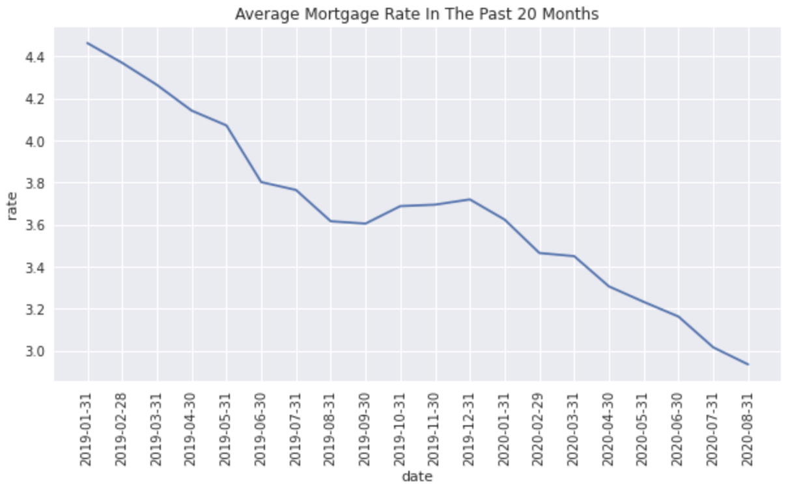
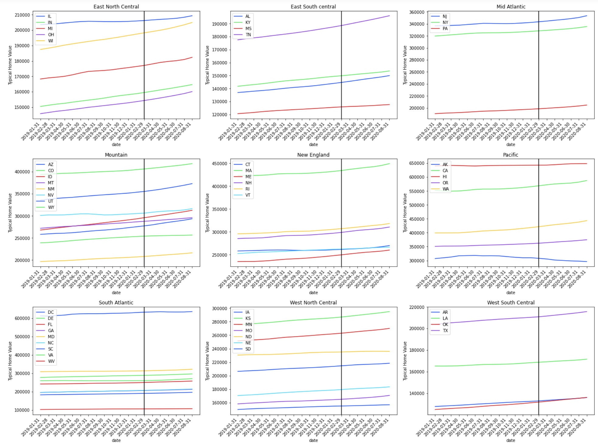
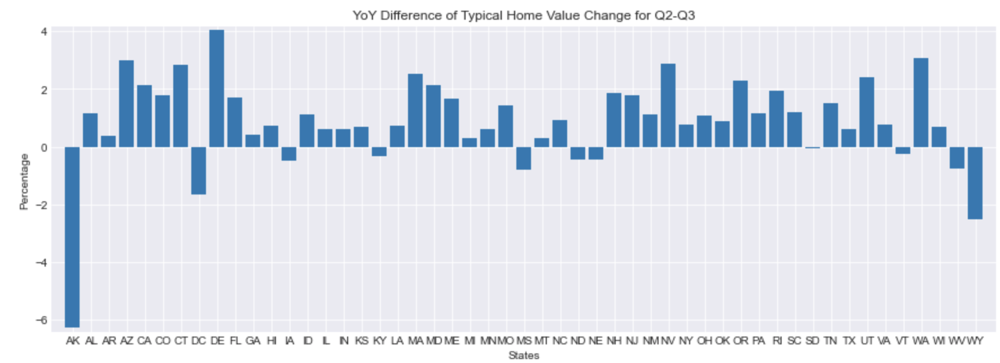
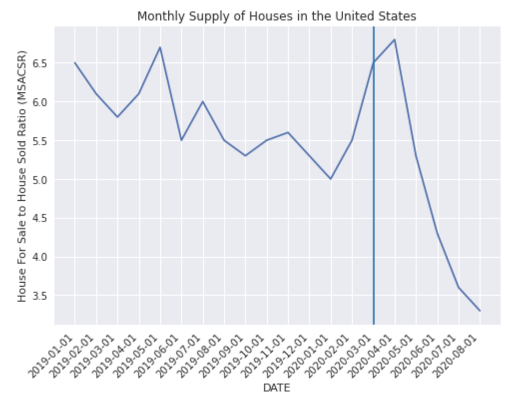
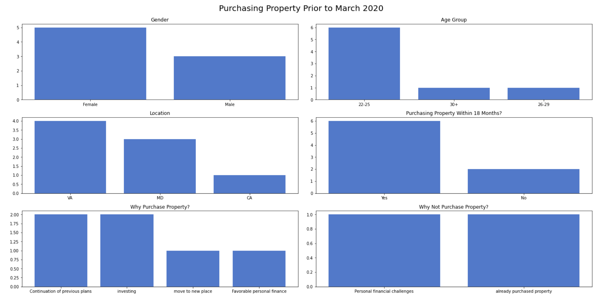
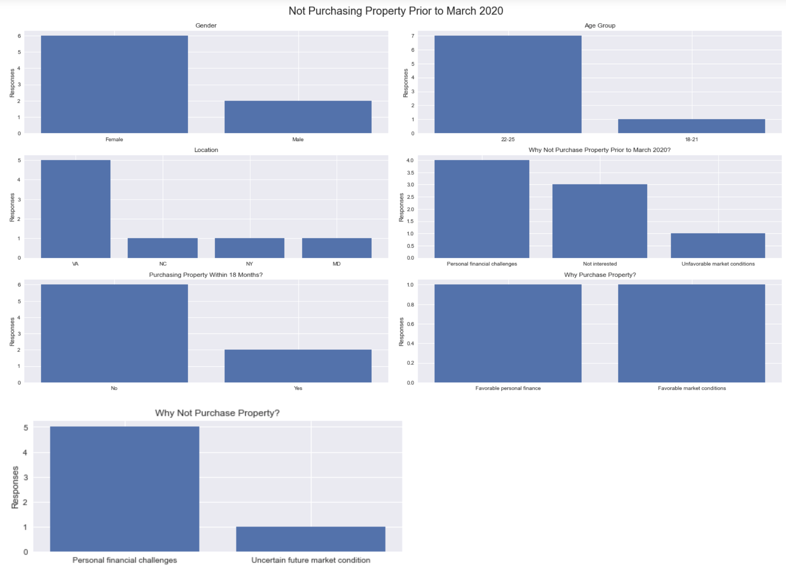

# U.S Housing Data

This analysis is looking to explore the following question.

1) Has covid-19 had an impact on the housing market?

## Data Description
Data was gathered from a couple different places.  

1) The average home value data set was obtained from Zillow’s research platform. The data set had already been adjusted for seasonality and smoothed. The data set contains home values from each state since 1996. However, it only contains homes in the 65th-95th percentile for each state.  

2) The 30 year interest rate was obtained from the Federal Reserve Bank of St Louis economic data portal. However, the main source is from Freddie Mac.  

3) The monthly supply of homes was obtained from the Federal Reserve Bank of St Louis economic data portal. However, the main source is the U.S Census Bureau. The data is a ratio of houses for sale to houses sold.

## Data Cleaning
Fortunately, the data was mostly cleaned. However, there was modifications done to it. For example, missing data was removed, time scale of data was standardized to monthly, and data frame index and columns were changed to have region on as columns and dates as a column.

## Data Exploration
To begin, the average monthly interest rate for 30-year loans was visualized. In can be observed that the average interest rate has been dropping since at least the beginning of January 2019. It briefly recovered about 10 basis points or .10% between August and December 2019. Since December, the average mortgage interest rate has been going lower to a historical low of under 3%.

The average home value was visualized. Each state was sorted to its region according to the U.S Census. Most visualizations have a clear trend going up, and a few show a downward sloping trend. A vertical black line was placed on the charts to signify when the World Health Organization declared Covid-19 a pandemic. To the unaided eye, it is hard to see if there has been a significant changes since covid-19 was declare a pandemic.

In order to explore change on the average home value, the difference of this year's and last year's rate of change was calculated. The percentage signifies how much more (or less) is the average home value by state. Arkansas’ average home value was 6% less than last year, and it was the state that contracted the most. Delaware was growing the most at about 4% more than last year, and it was the state the grew the most. 10 states saw a contraction in their average home value, 1 saw virtually no change, and 40 states saw various degrees of growth. 

The housing supply was explored too. This data shows a ratio of houses on sale to houses sold. The lower the ratio, the more houses sold and less houses for sale. It is obvious that there was a dramatic and significant drop after April of 2020. 

To further explore how the current environment has impacted the housing market, an unofficial and not strictly scientific survey was administered. The first group to be examined are participants that were looking to buy property precovid. From the 8 participants, 6 were still planning to buy property in the next 18 months. 1 participant had a already purchased property, and the last participant cited personal financial challenges as the reason to not wanting to buy property anymore. From the 6 participants that were still planning to buy property, 2 cited continuation of plans, 2 for investing purposes, 1 cited they wanted to move to a new place, and 1 had favorable personal finances. 

The last group were participants that were not planning to purchase property precovid. From the 8 participants, 4 cited personal financial challenges as the reason for not wanting to purchase property precovid, 3 were not interested, and 1 saw unfavorable market conditions. 6 participants still had no plans to purchase property in the next 18 months, 5 cited personal financial challenges as the reason for not having plans to purchase property, and 1 cited an uncertain future housing market. However, 2 were planning on purchasing property in the next 18 months. 1 cited favorable personal finances as the reason, and 1 cited favorable market conditions.

## Conclusion
Covid-19 has had positive and negative impacts on the housing market. For example, it is cheaper than ever to purchase a home because mortgage interest rates (the cost to borrow money) are at a record low. It is not know if this caused an increase in mortgage applications. Going off by our survey, it would indicate that only one participant possible saw this opportunity. Another way that Covid-19 has had a positive impact is that it has indirectly put upward pressure on the average home values on most states.

However, these are unintended results of a tragedy. The home for sale inventory has dropped significantly since at least April. This may be putting upward pressure on the average home values. The reason for the lack of inventory may be because of sellers are holding on to their homes, there are less homes being built, or there is more buyers than anticipated.

The survey performed has major limitations such as not being a representative sample of the population and not entirely controlled. However, it does give useful insights to start further investigation. The survey shows that little has changed in buyer sentiment. By going of this data, it can be explored if the reason for rising home values is a shortage of supply. 

Further research has to be done in order to understand if there has been a flood of home buyers, which may be the reason for an increase in home values. Data containing new mortgage applications would help explore this. A scientific survey should be performed in order to understand the exact reasons why buyers want to buy or not. Last, construction data is needed in order to further understand if there is a lack of construction of new homes. 

